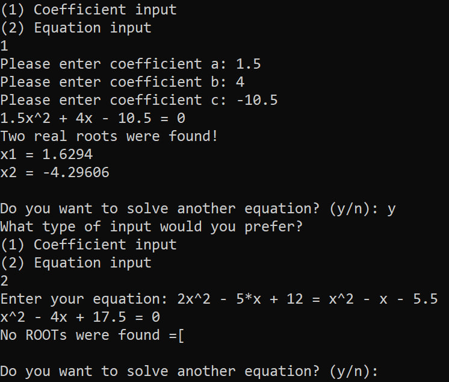

# QuadEquationSolver
**A simple program in C that can solve up to quadratic equations.**
<p align='center'>
    
</p>

# Installation

Use the following commands to download and compile the program.

```
git clone https://github.com/nniikon/QuadEquationSolver.git
cd .\QuadEquationSolver
.\compile.bat
```

Now the only thing left to do is to run KBADRATKA.exe

# Usage 

Now you can start your program!

```
.\KBADRATKA.exe
```

While coefficient input is fairly straightforward, equation input might pose more challenges.

You can utilize the `^` symbol to represent the exponentiation operation

You can choose whether to include the `*` multiplication symbol or not.

Example input / output:

```
x^2 - 5x + 12 = 5x^2 + x - 5

Two real roots were found!
x1 = -2.94374
x2 = 1.44374
```
<p align='center'>
    
</p>
